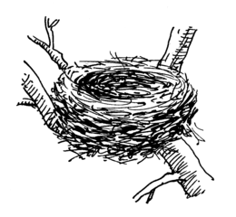

The Cnest Guide to Nest Containers
==================================

Introduction
------------

There are many [use
cases](https://docs.fedoraproject.org/en-US/containers/terminology/use_cases/)
for [OCI](https://opencontainers.org/) containers.
This guide is for the use case of contained user environments for interactive
shell sessions.
Containers used in this way are referred to here as [nest
containers](what-are-nest-containers.md).
Read [What are nest containers?](what-are-nest-containers.md) to learn more.

If you have any suggestions or additions for this guide to nest containers,
[start a discussion](https://github.com/castedo/cnest/discussions).
If you have any issues or feedback for the cnest package, [submit an
issue](https://github.com/castedo/cnest/issues) or email
[Castedo](mailto:castedo@castedo.com).

The scripts in the cnest package have been developed, tested and used since
early 2020. But there are [other tools](other-tools.md) that can be used to
create and use nest containers.
